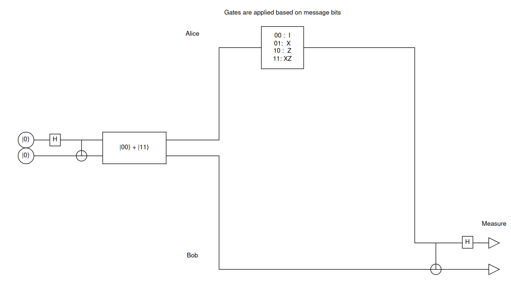
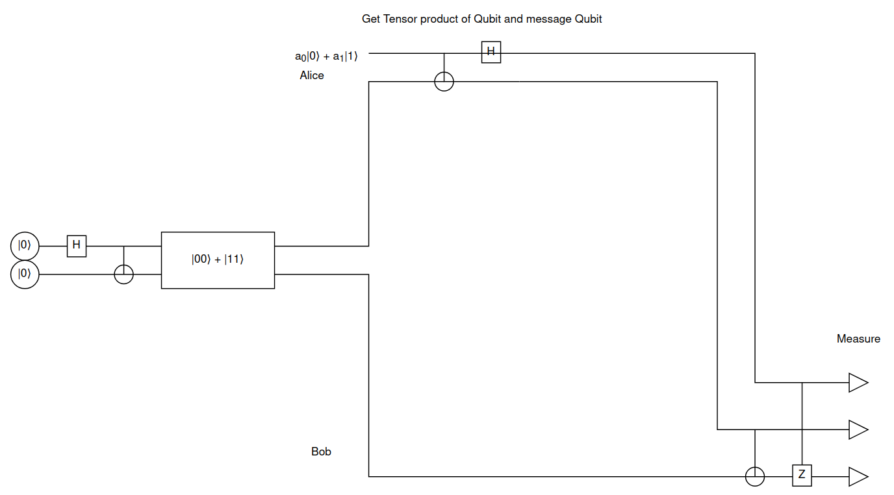
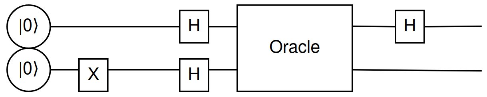

\clearpage

## Introduction
This labs aims to investigate the workings and usage of a couple of quantum algorithms. The 3 algorithms taken for this lab are:\

* Superdense Coding
* Quantum Teleportation
* Deutsch's Algorithm

### Superdense Coding
The algorithm is used to send two classical bits of information using only one qubit. The algorithm works by using a Bell pair to entangle two qubits. The bell pair that I used was the following:
$$
\frac{1}{\sqrt{2}}(|00\rangle + |11\rangle)
$$
Say we have two people, Alice and Bob. Alice takes the first qubit of the bell pair, Bob takes the second qubit. Alice then performs the following operations on her qubit:

1. If the first bit of the message is 1, apply the Z gate
2. If the second bit of the message is 1, apply the X gate \

Alice then sends her qubit to Bob. Bob then applies the following operations to his qubit:

1. Apply the CNOT gate (Control qubit is Alice's qubit)
2. Apply the Hadamard gate (To Alice's qubit)

Bob then measures the qubits and gets the two bits of information that Alice sent.

This circuit can be seen in the following diagram:\


This was implemented with the following code:
```python
import qiskit
from qiskit import *

def run_quantum_circuit(qubits, backend):
    qc = QuantumCircuit(4)
    # Initilaise qubits based on function input
    qc.initialize([1 - qubits[0], qubits[0]], 0)
    qc.initialize([1 - qubits[1], qubits[1]], 1)
    # Create state |00> + |11>
    qc.initialize([1, 0], 2) # Alice's qubit
    qc.initialize([1, 0], 3) # Bob's qubit
    qc.h(2)
    qc.cx(2, 3)
    # Apply pauli gates based on message qubits
    qc.cz(0,2)
    qc.cx(1,2)
    # Recreate the two message qubits from the one
    qc.cx(2, 3)
    qc.h(2)
    qc.measure_all()
    print(qc.draw())
    
    qc_compiled = transpile(qc, backend=backend)
    job = backend.run(qc_compiled) 
    
    result = job.result()
    counts = result.get_counts()
    for key, value in counts.items():
        print(f"Message Cubits: {key[1::-1]}\nReceived Cubits: {key[3:1:-1]}\n")
```

### Quantum Teleportation
The algorithm is used to teleport a qubit from one location to another. The algorithm works by using a Bell pair to entangle two qubits. The bell pair that I used was the following:
$$
\frac{1}{\sqrt{2}}(|00\rangle + |11\rangle)
$$
Say we have two people, Alice and Bob. Alice takes the first qubit of the bell pair, Bob takes the second qubit. Alice then performs the following operations on her qubit and the message qubit: (This gets the tensor product)\

1. Apply the CNOT gate
2. Apply the Hadamard gate \

The tensor product is then sent to Bob. Bob then applies the following operations to his qubit: \

1. Apply the CNOT gate (based on the second qubit of the tensor product)
2. Apply the Z gate (based on the first qubit of the tensor product)

Bob then measures his qubit which is now the message qubit.
This circuit can be seen in the following diagram:\
 \

The code for this algorithm is as follows:
```python
import qiskit
from qiskit import *

def run_quantum_circuit(message_qubit, backend):
    qc = QuantumCircuit(3, 3)

    # Create the state to be teleported in qubit 0
    qc.initialize(message_qubit, 0)
    qc.initialize([1, 0], 1)
    qc.initialize([1, 0], 2)

    # Create Bell State |00> + |11>
    qc.h(1)
    qc.cx(1, 2)

    # Get tensor product of qubits 0 and 1
    qc.cx(0, 1)
    qc.h(0)
    
    # The tensor product is given from alice to bob
    # The message qubit is recovered from the tensor product
    qc.cx(1, 2)
    qc.cz(0, 2)

    # The message qubit is measured
    qc.measure(2, 2)

    # qc.measure_all()
    print(qc.draw())
    
    qc_compiled = transpile(qc, backend=backend)
    job = backend.run(qc_compiled) 
    result = job.result()
    counts = result.get_counts()
    alpha0 = round(message_qubit[0] ** 2, 3)
    alpha1 = round(message_qubit[1] ** 2, 3)
    print(f"Message Qubits: {alpha0}|0⟩ + {alpha1}|1⟩")
    print(f"Received Qubits: ", end="")
    for key, value in counts.items():
        sum_values = sum(counts.values())
        print(f"{round(value/sum_values, 3)}|{key[0]}⟩ ", end="")
    print("")
```

### Deutsch's Algorithm
This algorithm is an algorithm that is used to determine whether a function is constant or balanced. A function is said to be constant if f(1) == f(0) and balanced if f(1) != f(0). The function can also be referred to as a black box function or an oracle.\
A superposition of the input qubits is created by applying the following steps:

1. Apply the X gate to the second qubit
2. Apply the H gate to both qubits\

By this point we have the quantum state: \
$$
|\psi\rangle = \frac{1}{\sqrt{2}}(|0\rangle|-\rangle + |1\rangle|-\rangle)
$$
The oracle is then applied to the qubits. The two oracles that I used were a constant oracle which did nothing and a balanced oracle which performed a CNOT gate with the first qubit as the control. The quantum state after the oracle is applied is:
$$
|\psi\rangle = \frac{1}{\sqrt{2}}(|0\rangle|U_f\rangle + |1\rangle|U_f\rangle)
$$
We now have an equation that looks like the phase oracle state. By now factoring out the $|-\rangle$ and removed due to irrelevance and taking the logic from the phase oracle state we get:
$$
for f(0) = f(1) \rightarrow |\psi\rangle = \pm \frac{1}{\sqrt{2}}(|0\rangle - |1\rangle) \\
for f(0) \neq f(1) \rightarrow |\psi\rangle = \pm \frac{1}{\sqrt{2}}(|0\rangle + |1\rangle)
$$
The hadamard gate is then applied to the first qubit and the qubits are measured. If the first qubit is 0, the function is constant, if the first qubit is 1, the function is balanced.

This circuit can be seen in the following diagram:\


The code for this algorithm is as follows:
```python
import qiskit
from qiskit import *
import qiskit as qs
from qiskit import QuantumCircuit, QuantumRegister,ClassicalRegister
from qiskit_aer import AerSimulator, Aer

def run_quantum_circuit(backend):
    regs = [QuantumRegister(2, 'q'), ClassicalRegister(1, 'c')]
    # Circuit segment before oracle
    init = QuantumCircuit(*regs)
    init.x(1)
    init.h(0)
    init.h(1)
    init.barrier()
    # Create circuits for oracle
    balanced = QuantumCircuit(*regs)
    balanced.cx(0,1)
    constant = QuantumCircuit(*regs)
    # Circuit segment after oracle for measuring
    end = QuantumCircuit(*regs)
    end.barrier
    end.h(0)
    end.measure(0, 0)
    
    # Run the circuits for both oracles
    for type, oracle in (('balanced:', balanced), ('constant:', constant)):
        qc = init.compose(oracle).compose(end)
        print(f"Circuit for oracle {type}")
        print(qc.draw())
        transpiled = transpile(qc, backend)
        job = backend.run(transpiled)
        result = job.result()
        counts = result.get_counts()
        for key, value in counts.items():
            key = int(key)
            if (key == 0):
                print(f"Key was 0 oracle is detected constant, was expected to be {type}")
            elif (key == 1):
                print(f"Key was 1 oracle is detected balanced, was expected to be {type}")
            else:
                print(f"Error: Invalid key, key is {key}")
```
